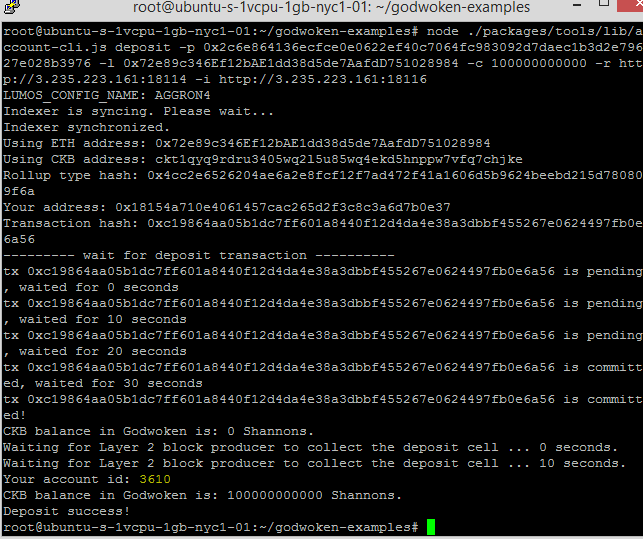

# 2021-Nervos-Broaden-the-Spectrum-task1

Task1: Create A Godwoken Account On The EVM Layer 2 Testnet


## A screenshot of the accounts you created (account list) in ckb-cli


## A link to the Layer 1 address you funded on the Testnet Explorer

```
https://explorer.nervos.org/aggron/address/ckt1qyq9rdru3405wq2l5u85wq4ekd5hnppw7vfq7chjke
```

## A screenshot of the console output immediately after you have successfully submitted a deposit to Layer 2

