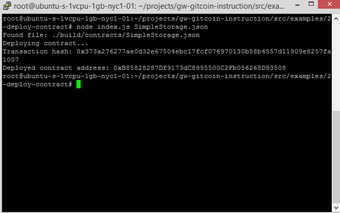

# Gitcoin: 2) Deploy a Simple Ethereum Smart Contract on Polyjuice

## A screenshot of the console output immediately after you have successfully deployed a smart contract.

## The transaction hash from the contract deployment (in text format).

0x373a276277ae0d32e67504ebc17fcf076970130b58b4557d11909e8257fa1007

## The deployed contract address from the contract deployment (in text format).

0xB85828287Df9173dC8995500C2Fb056268D93508

