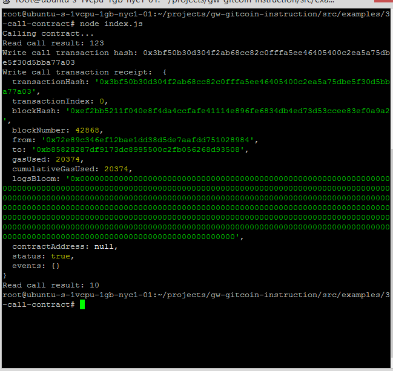

<h1> 1- A screenshot of the console output immediately after you have successfully issued a smart contract call.</h1>




<h1> 2- The transaction hash from the console output (in text format). </h1>

`0x3bf50b30d304f2ab68cc82c0fffa5ee46405400c2ea5a75dbe5f30d5bba77a03`

<h1> 3- The contract address that you called (in text format). </h1>

`0xB85828287Df9173dC8995500C2Fb056268D93508`
  
<h1>  4- The ABI for contract you made a call on (in text format). </h1>


```json
[
    {
      "inputs": [],
      "stateMutability": "payable",
      "type": "constructor"
    },
    {
      "inputs": [
        {
          "internalType": "uint256",
          "name": "x",
          "type": "uint256"
        }
      ],
      "name": "set",
      "outputs": [],
      "stateMutability": "payable",
 "type": "function"
    },
    {
      "inputs": [],
      "name": "get",
      "outputs": [
        {
          "internalType": "uint256",
          "name": "",
          "type": "uint256"
 }
      ],
      "stateMutability": "view",
      "type": "function"
    }
  ]
```
