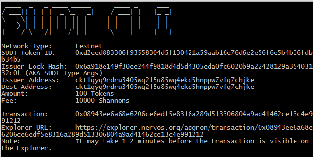
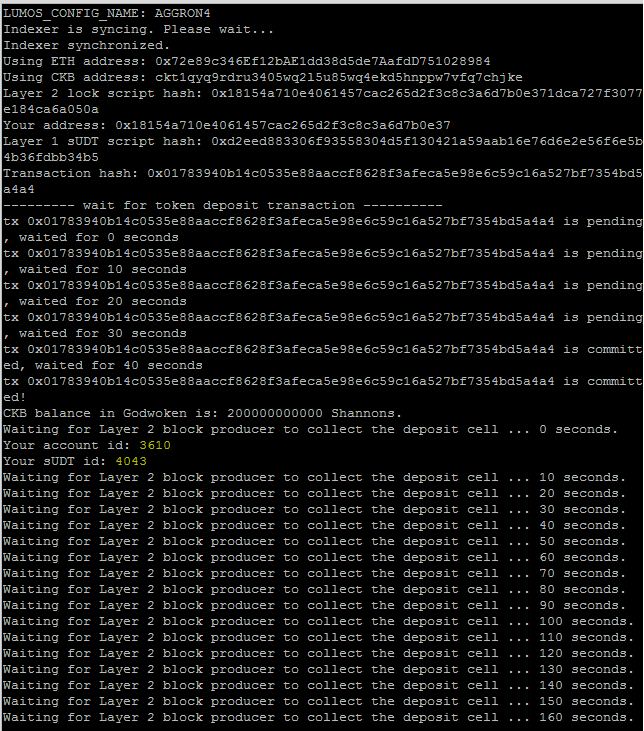

# Task 4

## 1. A link to the Layer 1 address you funded on the Testnet Explorer.

https://explorer.nervos.org/aggron/address/ckt1qyq9rdru3405wq2l5u85wq4ekd5hnppw7vfq7chjke

## 2. A screenshot of the console output immediately after using sudt-cli to create your SUDT tokens on Layer 1.




## 3. A link to the transaction ID created by sudt-cli on the Testnet Explorer.

https://explorer.nervos.org/aggron/transaction/0x08943ee6a68e6206ce6edf5e8316a289d513306804a9ad41462ce13c4e991212

## 4. A screenshot of the console output immediately after you have successfully submitted a deposit to Layer 2 using the account-cli tool.



## 5. The SUDT ID from the console output after executing the deposit script (in text format).

```Your sUDT id: 4043```


