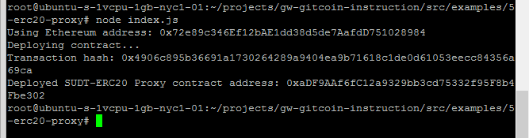
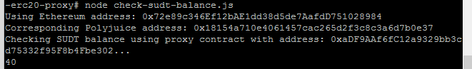

# Task 5

## A screenshot of the console output immediately after deploying smart contract.



## 2. The address of the ERC20 Proxy Contract you deployed (in text format).

```0xaDF9AAf6fC12a9329bb3cd75332f95F8b4Fbe302```


## 3. A screenshot of the console output immediately after checking your SUDT balance.



## 4.The Ethereum address that was checked (in text format).
```0x72e89c346Ef12bAE1dd38d5de7AafdD751028984```


