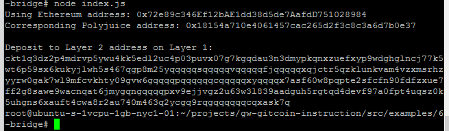

# Task 6

## A screenshot of the console output immediately after you have successfully generated your Deposit Receiver Address.



## 2. Your Deposit Receiver Address (in text format).

```ckt1q3dz2p4mdrvp5ywu4kk5edl2uc4p03puvx07g7kgqdau3n3dmypkqnxzuefxyp9wdghglncj77k5wt6p59sx6kukyjlwh5s467qgp8m25yqqqqqsqqqqqvqqqqqfjqqqqqxqjctr5qzklunkvam4vzxmsrhzyyrw0gak7wl9mfcvkhty09gvw6gqqqqpqqqqqqcqqqqqxyqqqqx7asf60w8pqpte2sfcfn90fdfzxue7ff2g8sawe9wacnqat6jmygqngqqqqpxv9ejjvgz2u63w3l839aadguh5rgtqd4devf97a0fpt4uqsz0k5uhgns6xauft4cwa8r2au740m463q2ycgq9rqgqqqqqqcqxask7q```


## 3. The Ethereum address used to generate the Deposit Receiver Address (in text format).

```0x72e89c346Ef12bAE1dd38d5de7AafdD751028984```

## 4. A link to the Etherscan explorer for the successful Force Bridge transaction. 

https://rinkeby.etherscan.io/tx/0xacd3033e8f8ee96580fa312942234daf4bb4513d7c0dbac7d9fb3c861bcd25e5

## 5. A link to the Nervos explorer for the successful Force bridge transaction. 

https://explorer.nervos.org/aggron/transaction/0x1738d6cfcf1a5d64ff20377cf245b78d03f0501903c18061a7738f5783e9db69
